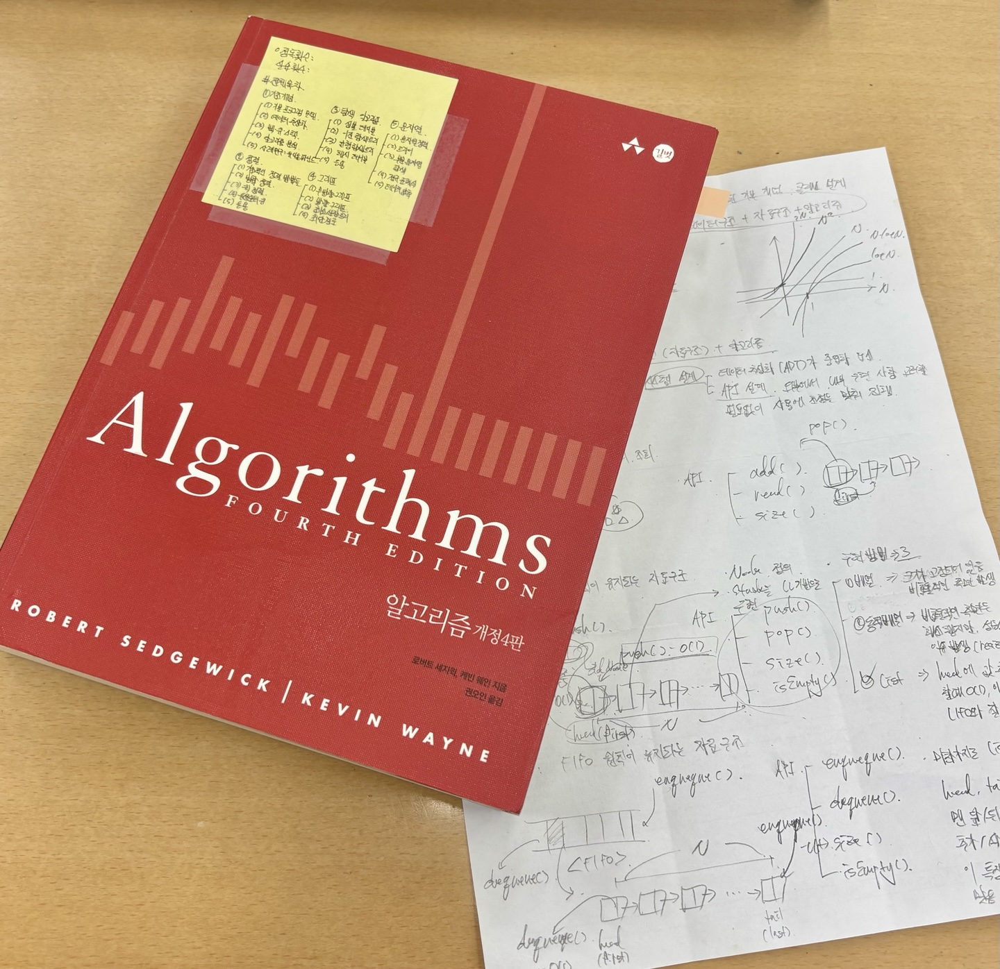

# Algorithms

## 얻고자 하는 것 
> - [1] 컴퓨팅 사고
> - [2] 자바 시스템 설계 & OOP 설계 능력
> - [3] 효율적인 알고리즘 구축 및 적용
> - [4] 문제 해결 능력
> - [5] 내가 만든 프로그램의 성능(속도, 메모리)에 대한 감각 키우기 

 

## 주요한 부분

- 시스템 설계과정
  - (1) 구현하고자 하는 대상이나 문제 상황 명확히 이해 
  - (2) API 정립
  - (3) 시스템 구조 설계(데이터 구조, 알고리즘 형태)
  - (4) 구현에 집중
  - (5) 문제 사항 도출 및 개선

 

## 끄적끄적
> - union find 초기 버전의 느낌은 각 지점마다 고유 id 부여하고 서로 연결되어 있을 경우 둘 중의 하나의 id로 통일해 나감 
